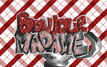
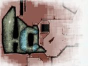
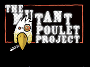
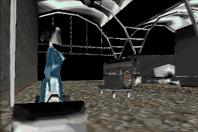

# Preservation of HCL Demos

Preservation effort focused on HCL's french demos (late 1990s).






## Build the extractor on Windows

Install CMake 3.15 or newer and Visual Studio with the Desktop development
with C++ workload, then run from the repository root:

```powershell
cmake -S . -B build -G "Visual Studio 17 2022" -A x64
cmake --build build --config Release
```

The executable is written to `bin/hcl_unpack.exe`, including when using a
multi-configuration generator. MSVC builds use the static C runtime.

```powershell
.\bin\hcl_unpack.exe demo-unpack\the-train\THETRAIN.HCL output-train
```

Entries with a `.HCL` extension (case-insensitive) are checked for PCX image
data. Recognized images receive an additional `.PCX` suffix: `00000.hcl`
becomes `00000.hcl.PCX`. Original filename casing and payload bytes are
preserved. Other entries retain their names. Existing output files are never
overwritten; use a fresh output directory to extract again.

Run the regression checks after building:

```powershell
powershell -NoProfile -ExecutionPolicy Bypass -File tests\unpack.ps1
```

These check all three demo archives against their extracted payload hashes,
PCX detection and naming, malformed data, and output collision handling.
Temporary test outputs are kept under the ignored `build/` directory.
